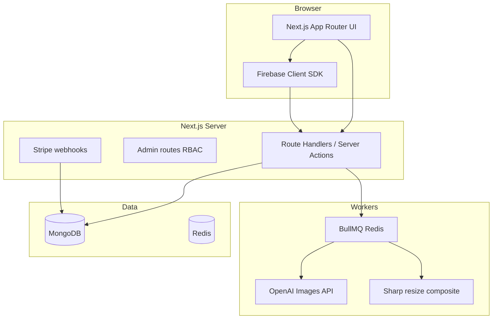

# Subvra: App Store creative generator (full build)

## Goals (condensed)

- **Product**: Users enter a **prompt** and **optional** reference app image; choose **iPhone / iPad** targets (6.7", 6.5" legacy under **Advanced**, 12.9" / 11" iPad); **one image per selected device**; **1 credit per generated image**. Generation uses **OpenAI GPT Image 2** (server-side key); output is **production-style App Store screenshots** (compose: generated artwork + optional device frame/template layer — implement as a clear pipeline so frames/overlays stay consistent).
- **Gating**: **Strictly no processing until** the user completes **Firebase auth** and has an **active trial or paid subscription** (or sufficient credits after purchase). First submit **persists draft** and redirects to auth; after success, **resume the same job automatically**.
- **Monetization**: **3-day trial, 2 credits**; subscriptions grant **monthly credits that expire** (no rollover); **top-up packs**; **teams** with **pooled org credits** and **extra per-seat** pricing; when sub is active but credits are 0, **auto-purchase smallest credit pack** (requires **saved Stripe payment method** — implement as default behavior with clear in-app copy and webhook safety).
- **Stack**: **Next.js 15 App Router** (RSC + route handlers), **Tailwind CSS** (best fit for your tokenized “technical minimalism” system), **MongoDB** on the **same VPS** in production, **Firebase Auth** (email/password + Google + Apple + email link “magic link”), **Stripe** (subscriptions + one-time packs + Customer Portal), **transactional email**, **Google Analytics** (gtag/next third-party pattern or `@next/third-parties`).
- **Ops**: **Docker Compose** on **Linux VPS** (app + MongoDB + **Redis** for job queue reliability); no Vercel requirement.

## Design references (mandatory)

Two complementary sources: **composition / narrative** (imagegen) and **design-system rigor + quality gates** (Impeccable).

### 1) `imagegen-frontend-web` (layout + narrative)

**Source**: [Leonxlnx/taste-skill — `skills/imagegen-frontend-web/SKILL.md`](https://github.com/Leonxlnx/taste-skill/blob/main/skills/imagegen-frontend-web/SKILL.md)

Use for **premium frontend art direction** (conversion-aware comps): **canonical layout intent** for marketing and signed-in surfaces.

- **Section discipline**: Distinct sections, each with a **conversion job** (hook / proof / educate / convert) and **different layout DNA** — avoid cloned “same card row” blocks. **Composition variety**, not one repeated template.
- **Hero bias**: **Do not default** to generic **left-text / right-image**; prefer alternatives from the skill when stronger; split only when it wins.
- **Brief mapping**: Subvra → **“SaaS / product / dashboard / fintech / infra”** path: **mid editorial** scale, **solid + inline asset**, **subtle** palette-matched gradients, **trust anchors**, **high implementation clarity**.
- **Combinatorial “engine” (Subvra-locked)**: Deep/slate **or** quiet neutral themes; **technical grid / dotted field** defaults; **Inter + monospace** with **Swiss-like hierarchy** (mono for telemetry/code snippets only).
- **Motion**: Micro-interactions only (float, fade, slide, hover lift).
- **Static comps (optional)**: One horizontal reference per section if generating mocks; in code → **one section component per block** with its own layout.

### 2) `impeccable` (tokens, a11y, anti-pattern discipline)

**Source**: [pbakaus/impeccable](https://github.com/pbakaus/impeccable) — skill + [seven domain references](https://github.com/pbakaus/impeccable/tree/main/skill/reference) (typography, color-and-contrast, spatial-design, motion-design, interaction-design, responsive-design, ux-writing), **23 commands** (`/impeccable audit`, `polish`, `critique`, `harden`, etc.), **deterministic anti-pattern rules**, and **[`npx impeccable detect`](https://www.npmjs.com/package/impeccable)** for CI/local scans (purple-gradient slop, bounce easing, cramped touch targets, etc.).

- **Workflow**: After major UI milestones, use **`/impeccable audit`**, **`critique`**, **`harden`** (checkout, auth, generator, empty states), and **`polish`** on marketing + dashboard. Prefer **`/impeccable teach`** (or **`document`**) once the codebase exists to maintain root **`PRODUCT.md`** and **`DESIGN.md`** as the **brand vs product register** Impeccable expects.
- **Installation**: Download bundle from [impeccable.style](https://impeccable.style) or copy the Cursor skill path from the repo `dist/` into the project per their README; keep license/NOTICE in mind (Apache-2.0).
- **Anti-patterns to respect** (adapt, don’t contradict Subvra on purpose):
  - Avoid **gray-on-colored-surface** body copy; use **tinted** neutrals / OKLCH scales with verified contrast (**Impeccable color reference**).
  - Avoid **card soup** — **nested cards**, everything wrapped in cards; align with Subvra “card-heavy but hierarchical”: **one clear card level** + surfaces/sections without nesting spam.
  - **No bounce/elastic** easing; purposeful motion per **motion-design** reference.
  - **Typography**: Impeccable warns against *default* Inter-only slop — Subvra **commits to Inter as brand** but must implement it **intentionally**: **modular type scale**, **tabular/ordinal where needed**, deliberate **second family** (monospace) for dev/telemetry, **OpenType** features where useful — document this exception in **DESIGN.md** (“brand register overrides generic-default warning”).

### How the two work together

| Concern | Primary source |
| --------|----------------|
| Section story, hero variety, “not another template landing” | `imagegen-frontend-web` |
| OKLCH palette, spacing rhythm, focus/loading/forms, responsive behavior, UX copy | `impeccable` references |
| Pre-ship QA + deterministic lint | `impeccable` CLI + commands |

### Explicit merge with Subvra brand tokens

- **Palette**: Deep blues (`primary` 600–800) + **slate neutrals** + **emerald** strictly for **positive/live/secure** — express in **OKLCH** in tokens where Tailwind v4 allows, with **accessible contrast** checks.
- **Surfaces**: Card-heavy **but not nested**; rounded corners, subtle borders, layered shadows — **enterprise dashboard** legibility.
- **Motifs**: `hero-tech-grid`, `section-grid`, `hero-crosshair` as repeatable **CSS/SVG** primitives.

## Competitive landscape (for positioning copy, not code)

Useful references when writing marketing/SEO differentiation: **Screenshot Lab** (macOS + ASO workflow), **AppMockup** / **AppMockup-style generators** (fast multi-device mocks), **AppScreenMagic / ScreenMagic-class tools** (AI + large style libraries), **StoreShots**, **AppDrift**. Subvra’s wedge: **credit-transparent, Apple-resolution-native export, team pools with seat economics, GPT Image 2**, and **infra-trust** brand (your specified visual language).

## High-level architecture

**Why Redis**: BullMQ gives you durable jobs, retries, and concurrency limits for OpenAI + image CPU work — fits VPS better than fire-and-forget serverless.

## Apple resolutions and generation mapping

- Maintain a **preset table** in code (single source of truth), e.g. `lib/apple-presets.ts`, keyed by `iphone_67`, `iphone_65_legacy`, `ipad_129`, `ipad_11`. Values must track **App Store Connect** documentation (store exact pixel WxH in config; comment with Apple marketing names).
- **UX**: Multi-select devices + **toggle** “Generate iPhone + iPad from one prompt” (when on, pre-select both families or last-used — product choice: default **all visible devices checked** with legacy 6.5" only if user opens Advanced).
- **Pipeline**: For each selected preset, **one GPT Image 2 call** (credits = device count). Request **high-res square or “auto”** as appropriate, then **Sharp**: crop/letterbox/pad to exact WxH, optional **template composite** (device frame + safe title/subtitle zones) stored as layered assets in `/public/templates` or SVG overlays.

## Credits, trial, and auto-buy

- **Ledger model**: Append-only `credit_transactions` + materialized `wallet` fields on `users`/`orgs` updated in Mongo transactions (or careful ordering + idempotency keys).
- **Job creation**: On submit, compute `credits_required = selectedDevices.length`. **Block** until wallet ≥ required (post-gate). **Atomic debit** when job starts (or reserve + settle — recommend **debit at start**, refund on hard failure).
- **Trial**: `trialEndsAt` + `trialCreditsGranted` (2) **or** mirror as transactions. **Subscription credits**: grant on `invoice.paid` / subscription webhook with **monthly period window**; **expire** by storing `validFrom`/`validUntil` per grant bucket or compute from Stripe period — simplest is **“monthly_pool” document** reset each period.
- **Auto-buy smallest pack**: On “generate” or periodic check when `credits === 0` and `subscription === active`, create **Stripe Invoice** or **PaymentIntent** for **smallest pack Price** using **off_session**; requires customer default payment method. **Idempotency** critical (Stripe idempotency keys + DB lock).

## Auth and draft persistence

- **Firebase**: Verify **ID token** on every protected API call (Firebase Admin SDK). Store `firebaseUid` on user record.
- **Draft flow**: On first-page submit, **save draft** to Mongo (`drafts` collection: prompt, optional image URL in **GCS/S3-compatible or local volume** for VPS — prefer **S3-compatible** or **upload to app disk with virus-scan stub**; for v1, **direct upload to server** with size/type limits + optional scan hook) and return `draftId`. After login, **claim draft** to `userId`. Resume job from `draftId` in query/session.

**Note**: Apple Sign-In requires extra Firebase console + Services ID setup — plan includes it in the checklist, not automatic magic.

## Teams (v1)

- Collections: `organizations`, `memberships` (role: owner/admin/member), `org_subscriptions` (Stripe `customer` at org level or **Stripe Connect** not needed for simple case — use **one Stripe Customer per org** for B2B clarity).
- **Pooled credits** at org level; **Stripe**: subscription with **base + per-seat** price items (Checkout adjustable quantity or separate seat SKU).

## Stripe catalog (suggested defaults — tune to your COGS)

Implement as **env-driven Price IDs** so you can change numbers without redeploying copy:

- **Starter** (~25 credits/mo), **Pro** (~80), **Team** (~200 + seats) — exact numbers TBD in Stripe Dashboard.
- **Top-ups** (one-time): e.g. **25 / 75 / 200** credits at stepped discounts; **smallest pack** used for auto-buy.
- **Webhooks**: `checkout.session.completed`, `customer.subscription.updated|deleted`, `invoice.paid`, `invoice.payment_failed`, `payment_intent.succeeded` — always **verify signature** and **idempotent** event processing (`stripe_events` collection).

## Admin panel

- **RBAC**: `users.role = admin` or separate `admins` allowlist.
- **Features**: user/org search, **credit adjustments with reason**, subscription state override (danger zone), job replay/cancel, fraud flags.
- **Analytics** (Mongo aggregations + nightly rollups optional):
  - **Usage**: generations/day, credits consumed, model errors, latency.
  - **Revenue**: MRR estimate from active subscriptions (from cached Stripe mirrors), payment success rate.
  - **Cohort retention**: weekly signup cohorts → week+1 return (define “return” as login or generation).
  - **Churn**: subscription cancellations / failed renewals.
- Export CSV for finance.

## Email

- Provider: **Resend** or **Postmark** (pick one; Resend is common with Next). Templates: welcome, trial started, receipt/invoice, low credits, auto-buy receipt, job complete.
- **Webhook failures**: alert admin if Stripe webhook or email fails repeatedly.

## SEO (you asked for a “detailed SEO setup”)

- `app/sitemap.ts`, `app/robots.ts`, per-route `metadata` (title/description/OG), JSON-LD (`SoftwareApplication`, `Organization`) in layout, canonical URLs, `hreflang` only if you add locales later.
- Content pages: **Terms, Privacy, Refund** + marketing landing with structured headings.
- Performance: **Lighthouse-minded** — next/image, font subsetting (Inter), route-level loading.

## Legal pages

- Static MDX or TS content modules in `content/legal/` with last-updated dates; link from footer and checkout.

## Security and compliance

- Never send OpenAI key to client.
- **Rate limit** generation endpoints (per IP + per user) via Redis.
- **Content policy**: surface OpenAI refusals gracefully; store failure reason on job doc.
- **Uploaded images**: strip EXIF if desired; max size; virus scan backlog optional.

## Docker / VPS layout (opinionated default)

- `docker-compose.yml`: `app` (Next.js Node 22 LTS), `mongo`, `redis`, `nginx` (TLS termination + reverse proxy), optional `mongo-express` **not** in prod.
- Persistent volumes for Mongo data; backups (mongodump cron) documented.
- Env: all secrets in `.env` on host or Docker secrets.

## Repository layout (proposed)

- `app/(marketing)/` — landing, SEO, legal
- `app/(auth)/` — sign-in/up flows (Firebase UI routes)
- `app/(dashboard)/` — generator, history, billing portal link, team
- `app/api/` — webhooks, generation, uploads, internal cron if needed
- `lib/` — firebase-admin, stripe, mongo, openai, presets, credits
- `jobs/` — BullMQ processors

## Phased delivery (recommended)

1. **Foundation**: Next.js + Tailwind theme tokens (Impeccable-aligned: OKLCH, rhythm); marketing sections per imagegen-frontend-web; vendor Impeccable skill + baseline `PRODUCT.md` / `DESIGN.md`; Mongo models; Firebase auth wiring; basic dashboard shell.
2. **Billing**: Stripe products, Checkout, webhooks, credit ledger + trial + subscription grants.
3. **Generator**: GPT Image 2 integration, Sharp pipeline, preset exports, job queue, download zip.
4. **Gating + drafts**: anonymous draft → auth → resume; strict processing rules.
5. **Teams + seats**: org model, pooled credits, Stripe seat items.
6. **Admin + analytics**: aggregates, cohort/churn/MRR views.
7. **Email + GA + SEO hardening** + Impeccable pass (`polish`, `audit` on critical routes) and optional `npx impeccable detect` in CI.
8. **Docker + VPS runbooks** (staging/prod hostnames left as TBD env vars until you buy domains).

## Open decisions (non-blocking for implementation start)

- **Asset storage**: local disk vs S3-compatible (MinIO on same VPS) for reference uploads and generated files — recommend **S3-compatible** for backup/scale.
- **Staging domain**: use `staging.<your-domain>` with separate Stripe **test mode** keys and Firebase project or same project with authorized domains list.

## Key risks

- **Brand vs Impeccable defaults**: Inter is intentional for Subvra — mitigate “generic SaaS” risk via **modular scale**, **mono accent**, **OKLCH neutrals**, and **imagegen** composition rules; record the decision in `DESIGN.md`.
- **GPT Image 2** availability/tier on your OpenAI org — verify in dashboard before promising SLAs.
- **Auto-buy** can surprise users — mitigate with email + in-product settings (“Auto top-up: on/off”) even if default on.
- **Firebase + custom server sessions**: standard pattern is **JWT from Firebase** per request, not NextAuth (unless you bridge — avoid duplication).

